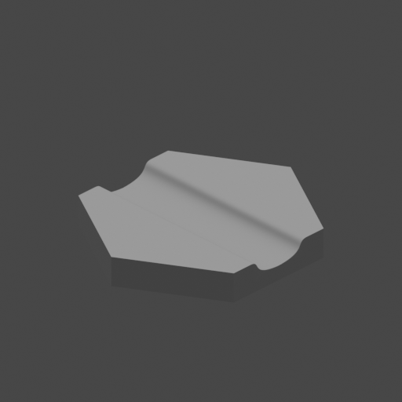
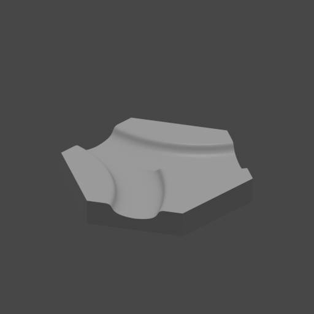
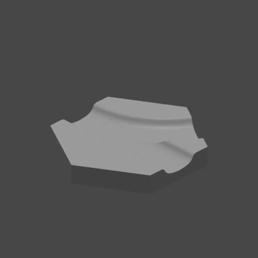

# Core set of hexagons for HexWorld
## Hexagon Base

## Hexagon Canal Straight Bezier

## Hexagon Canal Curve Bezier

## Hexagon Canal Split Bezier

## Hexagon Canal Strtaight Curve North East Bezier

## Hexagon Canal Strtaight Curve North West Bezier



Convert OpenSCAD to STL -> Blender -> FBX run:
```shell script
blender -b -P ./ConvertOpenSCAD2FBX.py
```
Or
```shell script
blender --background --python ./ConvertOpenSCAD2FBX.py
```
On Ubuntu (snap script ignores --background):
```shell script
 /snap/blender/current/blender --background --python ConvertOpenSCAD2FBX.py
```

