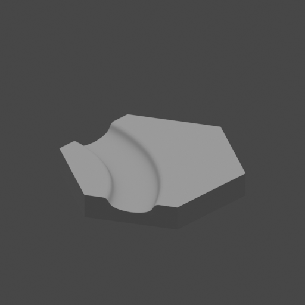

# Core set of hexagons for HexWorld
All files are modelled in [OpenSCAD](https://openscad.org/), a paremetric CAD modelling program.

### Slope
The slope of the canal is done with a bezier curve:

`function cubic_bezier(p0,p1,p2,p3) = [for (t=[0:deltat:1+deltat]) pow(1-t,3)*p0+3*pow((1-t),2)*t*p1+3*(1-t)*pow(t,2)*p2+pow(t,3)*p3];`

## Hexagon Base

## Hexagon Canal Straight Bezier

## Hexagon Canal Curve Bezier

## Hexagon Canal Split Bezier

## Hexagon Canal Strtaight Curve North East Bezier

## Hexagon Canal Strtaight Curve North West Bezier


## Conversion 
Convert OpenSCAD to STL -> Blender -> FBX run:
```shell script
blender -b -P ./ConvertOpenSCAD2FBX.py
```
Or
```shell script
blender --background --python ./ConvertOpenSCAD2FBX.py
```
On Ubuntu (snap script ignores --background):
```shell script
 /snap/blender/current/blender --background --python ConvertOpenSCAD2FBX.py
```

